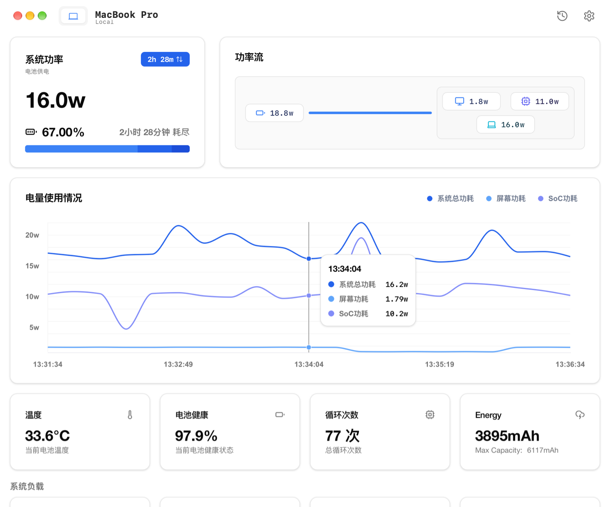
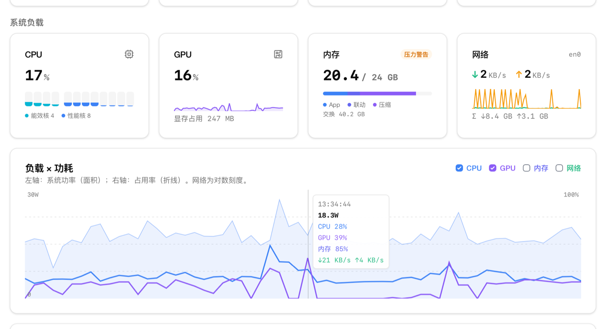
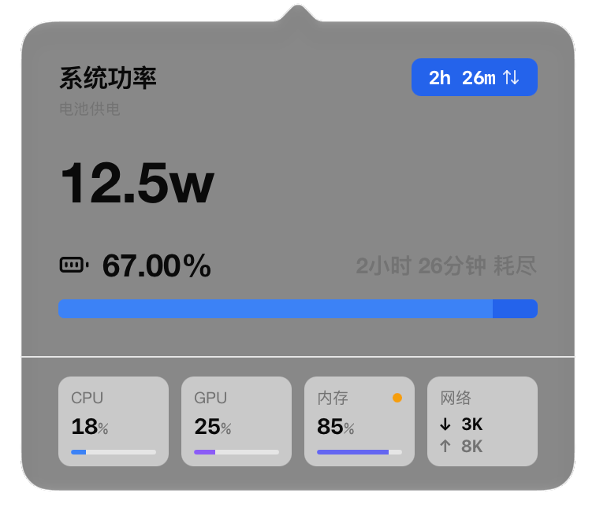
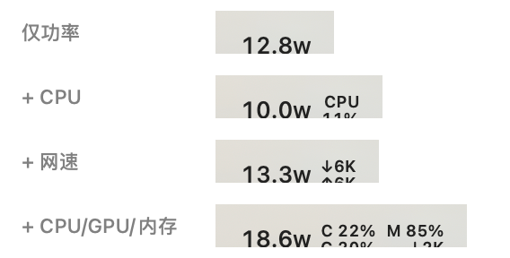

# Trickle

English | [简体中文](README.zh-CN.md)

A macOS menu bar power monitor that also shows where the power goes: live power
flow, battery health and charging status, alongside CPU, GPU, memory and network
load on the same time axis.

Trickle is a fork of [lzt1008/powerflow](https://github.com/lzt1008/powerflow). The
upstream project has had no commits since March 2025 and crashes on macOS 26/27;
Trickle continues maintenance and fixes those failures.



| System load | Menu bar panel | Status bar styles |
|---|---|---|
|  |  |  |

> Pre-release. No signed build is distributed yet, so a locally built app needs
> to be opened past Gatekeeper (see [Installing](#installing)).

## Branches

| Branch | For |
|---|---|
| `main` | Power only. The original scope: power flow, battery, charging. |
| `feat/system-monitor` | Everything in `main`, plus system load monitoring. |

System load can also be switched off entirely in Settings, in which case nothing
is sampled and the app behaves like `main`.

## Features

### Power

- **Live power flow** — adapter input, system load, battery charge/discharge,
  screen and heatpipe draw, and adapter conversion loss
- **Battery health** — design capacity, full charge capacity, cycle count, and
  remaining time estimate
- **Health trend** — daily capacity snapshots plotted over time, so decay is
  visible across months. History survives upgrades.
- **Adapter details** — hover the wattage badge for the live draw against the
  adapter's rating, negotiated USB-C PD tier, and conversion loss. A charger
  delivering well below its rating is the usual answer to "why is this charging
  slowly".
- **History** — charging sessions recorded with power detail
- **iOS devices** — monitor paired iOS/iPadOS devices over USB or Wi-Fi

### System load

- **CPU** — overall usage and per-core bars, split into efficiency and
  performance cores
- **GPU** — utilisation and driver memory in use. Hidden if the GPU reports no
  utilisation.
- **Memory** — memory pressure first, usage second (full memory is normal on
  macOS; pressure is what tells you it is a problem), with app / wired /
  compressed breakdown and swap
- **Network** — download and upload rate, totals since boot. Only physical
  interfaces are counted, so VPN traffic is not counted twice.
- **Load × Power** — system power and load plotted together, to answer "what is
  this 20 W being spent on"
- **Energy usage by app** — Activity Monitor's energy impact, now with CPU and
  memory columns from the same sample. Measured on demand, since sampling costs
  about a second.
- **Menu bar** — a compact row of load figures in the panel, and optional
  two-line stacks after the power figure in the status bar (`+ CPU`,
  `+ Network`, or `+ CPU/GPU/Mem`). Drawn natively with tabular digits so the
  item does not change width as the numbers do, and tinted by macOS for light,
  dark and highlighted menu bars.

All system figures come from kernel counters (`host_processor_info`,
`host_statistics64`, IORegistry `IOAccelerator`, `net.link.generic` MIB). No root,
no helper, no extra timer: they are read on the existing power tick.

## Requirements

macOS 11 or later. Verified on macOS 27.0 / Apple Silicon. For macOS 26, the
battery readers fall back between the old and new key layouts and every system
load API used here predates macOS 11, but this has not been run on a macOS 26
machine. Intel Macs run but some SMC sensors are
unavailable there (see [#18](https://github.com/lzt1008/powerflow/issues/18)),
and there is no efficiency/performance core split.

## Resource usage

Measured on macOS 27.0 / M-series, sampling every 5 seconds, using CPU time
deltas and physical footprint rather than the `%cpu` and RSS columns, which
report lifetime averages and shared mappings respectively:

| | CPU | Memory |
|---|---|---|
| Menu bar only | ~1.7% | 270-290 MB |
| Main window open | ~19% | ~450 MB |

The window-open figure is the cost of the live chart and the animated readout;
turning off animations in Settings reduces it. Memory is dominated by WebKit:
the settings window is created on demand rather than at launch, which keeps one
fewer web view resident.

Turning system load on adds about 0.05 percentage points of CPU in the menu bar
only state (0.66% → 0.71% in a back-to-back measurement on the same machine).

## Installing

Trickle is not notarised, so macOS refuses to open it on first launch either
way. Right-click the app and choose Open, or clear the attribute:

```bash
xattr -dr com.apple.quarantine /Applications/Trickle.app
```

Installing through Homebrew does not avoid this — it only makes upgrades easier:

```bash
brew install --cask swsususu/tap/trickle
```

Or download the DMG from
[Releases](https://github.com/swsususu/Trickle/releases/latest).

Coming from powerflow? See [FAQ](#faq).

## Building from source

```bash
pnpm install
pnpm tauri build
```

Building the DMG through `create-dmg` can time out on macOS 27 while AppleScript
styles the Finder window. The `.app` is produced before that step, so
`pnpm tauri build --bundles app` is a working alternative.

Tests and a hardware probe:

```bash
cargo test -p tpower -p trickle
cargo run -p tpower --example system   # prints one live system sample
cargo run -p tpower --example probe    # prints battery / SMC readings
```

## What is fixed relative to upstream

macOS 26/27 moved and removed several `AppleSmartBattery` keys, which is the root
of most of these:

| Key | macOS 27 |
|---|---|
| `AppleRawCurrentCapacity` / `AppleRawMaxCapacity` | gone |
| `DesignCapacity` / `Temperature` / `AbsoluteCapacity` | gone from the top level |
| `CurrentCapacity` / `MaxCapacity` | present, but a 0-100 percentage, not mAh |
| `BatteryData` (nested dict) | holds the real mAh values |
| `TimeRemaining` | `65535` sentinel |

Each value falls back to the older top-level key, so the same build reads both
layouts.

- Startup crash: the unchecked unwrap on missing keys, combined with
  `mem::transmute` over a struct with absent fields, produced a SIGSEGV with no
  panic message
- Battery health showing no data, from the same missing keys
- "1092 hours to full": the `TimeRemaining` sentinel was formatted as a duration
- Charging state stuck on while resting at 100%, because SMC `CHCC` keeps
  reporting `1.0` there; IOKit's `FullyCharged` is now trusted first
- A plugged-in machine described as running on battery
- Chart freezing: a stale `statusBarItem` value panicked inside the power-tick
  task and silently killed the sampling loop
- An IOKit object leaked once every two seconds
- Status bar panel not opening at all: an attached tray menu makes AppKit swallow
  `mouseDown:`, so no click event reached the app
- The panel rendering only skeletons, because an NSPopover window always reports
  `visibilityState: hidden`
- The panel being buried under fullscreen apps
- `showCharging` preference key mismatch, which made the setting do nothing
- Release builds failing at `sqlx-macros` with "mis-aligned LINKEDIT string
  pool" ([rust-lang/rust#157750](https://github.com/rust-lang/rust/issues/157750))

The core battery fixes were cherry-picked from
[powerflow#22](https://github.com/lzt1008/powerflow/pull/22) by @cnveteran, whose
diagnosis was correct; the rebranding in that PR was left out so the fixes apply
on their own.

## FAQ

**Does Trickle replace powerflow?**

No. They are separate applications with different bundle identifiers, so
installing Trickle leaves powerflow in place and does not import its history.
Remove powerflow if you do not want two menu bar icons. If it was installed
through Homebrew:

```bash
brew uninstall --cask lzt1008/powerflow/powerflow
brew untap lzt1008/powerflow
```

**Homebrew warns that `lzt1008/powerflow` is not trusted.**

Recent Homebrew versions require taps to be trusted explicitly and list every
untrusted tap on each command. The warning comes from the old powerflow tap, not
from Trickle; the two commands above remove it. The same applies to any other
tap listed there that you no longer use.

**Homebrew says the latest version is already installed, but a newer release
exists.**

Update the tap first, then upgrade:

```bash
brew update
brew upgrade --cask swsususu/tap/trickle
```

**I only want power monitoring.**

Turn off **Settings → System Load → Monitor System Load**. Nothing is sampled
while it is off. The `main` branch also stays power-only; see
[Branches](#branches).

## License

MIT. Original copyright The Powerflow Team; modifications copyright swsususu.
See [LICENSE](LICENSE).
